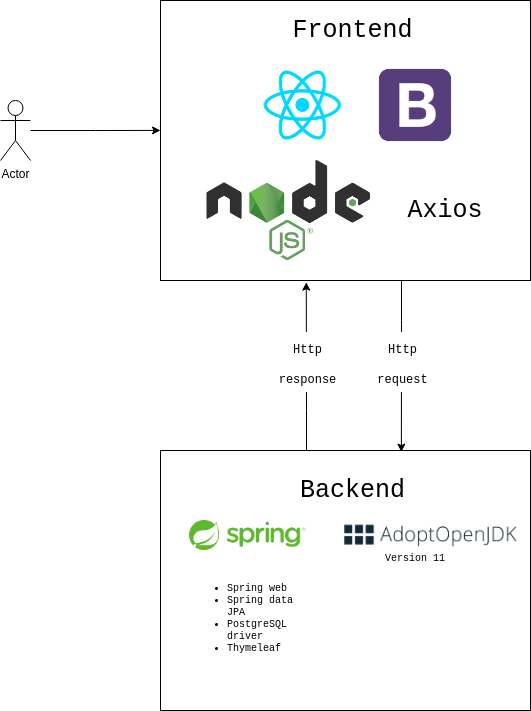

# ToDo EXP 
## An LBYCPD2 Final Project 

Under supervision of Engr. Dino Ligutan, ToDo EXP is a to-do list that aims to provide some fun
to the notion of to-do lists. 

Much like the to-do lists created before it, ToDo EXP will allow its users to set dates for their tasks, add
subtasks, titles, descriptions, etc. However, what sets it apart from other to-do lists is that it has an internal
reward system. This reward system will allow users to gather badges and other in-app items.

Do note that this is very much a school project, and is not intended to be deployed to the masses. However,
it is the group's goal to have the application itself deployed in the cloud.

### What technologies are used in this application?

The application utilizes NodeJS for Javascript, Bootstrap for the style, and React as the overall Javascript framework.

In the backend, the application utilizes the Spring Framework, with several dependencies which include, but are not limited to:

- Spring Data JPA
- Thymeleaf
- Spring Web
- PostgreSQL Driver for Spring

The database management system is PostgreSQL. 

## How to run?
For those interested in developing the project, Jetbrains IntelliJ IDEA was used for this project.
Maven was used as the dependency manager, and Adopt-OpenJDK 11 was used as the Java implementation.
Therefore, the following must be installed in the computer.

- Maven
- Adopt-OpenJDK11
- PostgreSQL 

## A word about PostgreSQL
Before running the application, an instance of PostgreSQL must already be running in the background.
By default, PostgreSQL runs in port 5432. In PostgreSQL, there should be a table entitled todoexp-dev. 
Do note that these can be easily edited to suite your developer environment by going to `src/main/resources/application.properties`.
